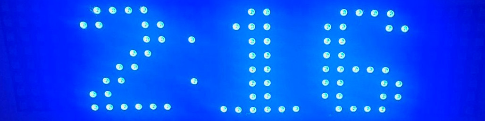
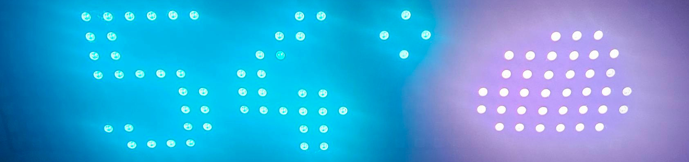

# LED Smart Clock

<p align="center">
  
  <br>
  
</p>

LED Smart Clock is an ESP32-based wall clock for an 8x32 WS2812B LED matrix. It combines a large time display with GPS, NTP, RTC fallback, weather, air quality, weather alerts, automatic brightness, a web dashboard, diagnostics, live console logging, configuration backup and restore, and browser-based firmware updates.

<p align="center">
  <a href="https://www.pcbway.com/" target="_blank">
    
  </a>
</p>

## Project Supporter: PCBWay

This project is supported by [PCBWay](https://www.pcbway.com/), a PCB fabrication and prototype manufacturing service that helps bring hardware projects from breadboard or hand-wired prototypes into cleaner, more repeatable physical designs.

PCBWay helps this LED Smart Clock project and many other maker, hobby electronics, student, and open-source hardware projects by making custom PCB manufacturing more accessible. Their cost-effective prototyping services make it practical to test a board, revise the design, and continue improving the hardware without needing a large production run.

For a project like this, a professionally manufactured PCB helps reduce loose wiring, makes the build easier to assemble, improves long-term reliability, and gives other builders a clearer hardware reference to follow. That support benefits this project directly, but it also helps the broader community by making shared designs easier to reproduce, modify, and improve.

PCBWay offers a useful path for electronics projects that need more than a one-off breadboard build, including prototype PCBs, small-batch board runs, and manufacturing services that can support projects as they move from early testing toward a finished design.

Thank you to PCBWay for supporting this project and for helping makers, developers, and open-source hardware projects turn working ideas into real hardware.

## Highlights

- Large 12-hour or 24-hour clock display on an 8x32 LED matrix.
- Hybrid timekeeping from GPS, NTP, and a DS3231 RTC.
- Automatic DST when a named timezone is available, with manual zone-name selection plus fixed-offset and GPS-longitude fallbacks.
- Location from GPS, saved coordinates, reverse geocoding, or IP geolocation fallback.
- Rotating matrix messages for date, current temperature, current weather, daily forecast, AQI, weather alerts, sunrise, and sunset.
- Automatic display colors: time shifts from yellow at 6 AM through green toward blue at night, and temperature shifts from cold blue through green/yellow to hot red.
- Ambient-light brightness control with user-configurable display behavior.
- Web dashboard with service health, build metadata, GPS state, weather, AQI, alerts, and sun-event source.
- Diagnostics page with live service status, GPS recovery actions, raw NMEA, and one-shot display tests.
- Live web console with downloadable in-memory logs and web-triggered debug commands.
- Advanced hardware-pin settings for adapting the LED matrix, GPS UART, and shared I2C bus to different ESP32 boards.
- First-boot onboarding, optional password protection, dark mode, Basic and Advanced config views, factory-default reset, OTA updates, and version-tolerant config backup and restore.

## Quick Links

- Install or update the clock: [INSTALL.md](INSTALL.md)
- Hosted web installer: `https://cosmicc.github.io/LEDSmartClock/`
- Latest releases: `https://github.com/cosmicc/LEDSmartClock/releases`
- Feature changelog and roadmap: [docs/feature-changelog.md](docs/feature-changelog.md)

## Display Colors

By default, the clock face uses an automatic time-of-day color. The time starts yellow at 6:00 AM, progressively moves through green, and reaches blue at night.

Current temperature uses automatic temperature coloring. Cold readings are blue, moderate readings move through green and yellow, and hot readings become red.

Both automatic behaviors can be overridden in the web configuration with static colors:

- `Configuration` -> `Advanced` -> `Clock & Time` -> `Use static clock color` and `Static clock color`
- `Configuration` -> `Advanced` -> `Current Temp` -> `Use static temperature color` and `Static temperature color`

## Hardware

The current project assumes:

- ESP32 development board with enough usable GPIO for the display, GPS UART, shared I2C bus, and optional config/status pins
- 8x32 WS2812B LED matrix
- DS3231 RTC module
- TSL2561 light sensor
- NEO-6M GPS module
- 5V power supply sized for the LED matrix
- Custom PCB revision manufactured with support from PCBWay for cleaner module interconnects and power wiring

The default PlatformIO environment is `esp32dev`, but named environments are available for common ESP32 boards. Choose the PlatformIO environment and pin settings that match your actual ESP32 module before flashing.

Common PlatformIO environments:

| Environment | PlatformIO board ID | Board/profile | Default pin notes |
| --- | --- | --- | --- |
| `esp32dev` | `esp32dev` | Generic Espressif ESP32 Dev Module, default build | Uses the project defaults below |
| `esp32doit-devkit-v1` | `esp32doit-devkit-v1` | DOIT ESP32 DEVKIT V1 | Uses the project defaults below |
| `nodemcu-32s` | `nodemcu-32s` | NodeMCU-32S | Uses the project defaults below |
| `wemos_d1_mini32` | `wemos_d1_mini32` | WEMOS D1 Mini ESP32 | Uses the project defaults below |
| `lolin32` | `lolin32` | WEMOS LOLIN32 | Uses the project defaults below |
| `esp32-s3-devkitc-1` | `esp32-s3-devkitc-1` | Espressif ESP32-S3-DevKitC-1 | Defaults to LED data GPIO 33 and I2C GPIO 8/9 |

Build a specific board with `platformio run -e <environment>`, for example `platformio run -e esp32-s3-devkitc-1`. These environments select the PlatformIO board target and firmware hardware-profile label; use the web `Hardware Pins & Matrix Layout` settings when your wiring differs from the project defaults.

### ESP32 Pinout

These are the shipped default GPIO assignments for the default `esp32dev` build. They are not a requirement; use the Advanced `Hardware Pins & Matrix Layout` settings or build flags below when your ESP32 module uses a different pinout.

| Device | Device Pin | ESP32 Pin | Firmware Reference | Notes |
| --- | --- | --- | --- | --- |
| WS2812B 8x32 LED matrix | `DIN` / data in | GPIO 23 | `LEDCLOCK_DEFAULT_LED_DATA_PIN` / `led_data_pin` | FastLED drives the matrix data line from this pin. Changing it in Advanced config requests a reboot. |
| NEO-6M GPS | `TX` | GPIO 16 | `LEDCLOCK_DEFAULT_GPS_RX_PIN` / `gps_rx_pin` | GPS transmit connects to ESP32 receive. Default baud is `9600`, configurable in the web UI. |
| NEO-6M GPS | `RX` | GPIO 17 | `LEDCLOCK_DEFAULT_GPS_TX_PIN` / `gps_tx_pin` | ESP32 transmit connects to GPS receive for receiver commands and recovery tools. |
| DS3231 RTC | `SDA` | GPIO 21 | `LEDCLOCK_DEFAULT_I2C_SDA_PIN` / `i2c_sda_pin` | Shared I2C data line with the TSL2561. Applies when saved. |
| DS3231 RTC | `SCL` | GPIO 22 | `LEDCLOCK_DEFAULT_I2C_SCL_PIN` / `i2c_scl_pin` | Shared I2C clock line with the TSL2561. Applies when saved. |
| TSL2561 light sensor | `SDA` | GPIO 21 | `LEDCLOCK_DEFAULT_I2C_SDA_PIN` / `i2c_sda_pin` | Connect to the same I2C bus as the RTC. |
| TSL2561 light sensor | `SCL` | GPIO 22 | `LEDCLOCK_DEFAULT_I2C_SCL_PIN` / `i2c_scl_pin` | Connect to the same I2C bus as the RTC. |
| Optional configuration button | One side of momentary switch | GPIO 19 | `LEDCLOCK_DEFAULT_CONFIG_PIN` / `CONFIG_PIN` | Compile-time recovery pin. IotWebConf reads it before saved config is loaded; connect the other side of the switch to `GND`. |
| Built-in status LED | On-board LED | GPIO 2 | `LEDCLOCK_DEFAULT_STATUS_PIN` / `STATUS_PIN` | Compile-time IotWebConf status LED. Usually no external wiring is needed on common ESP32 dev boards. |

Pin customization:

- In the web interface, open `Configuration` -> `Advanced` -> `Hardware Pins & Matrix Layout` to change `led_data_pin`, `gps_rx_pin`, `gps_tx_pin`, `i2c_sda_pin`, `i2c_scl_pin`, and the LED matrix layout dropdowns.
- GPS and I2C pin changes are applied when saved. LED data pin and matrix layout changes request a reboot because FastLED binds those display settings during startup.
- The backup/export file includes the hardware profile label, runtime pin settings, and matrix layout settings, so hardware customizations move with the rest of the saved configuration.
- Runtime pins cannot overlap each other or the compile-time config button/status LED pins. Move `LEDCLOCK_DEFAULT_CONFIG_PIN` or `LEDCLOCK_DEFAULT_STATUS_PIN` with build flags first if your board needs those GPIOs for another signal.
- Avoid GPIO 6-11 on classic ESP32 boards because they are normally connected to flash. On ESP32-S3 boards, avoid GPIO 27-32 because they are normally flash pins, and GPIO 22-25 are not valid on the S3 target. On classic ESP32 boards, GPIO 34-39 are input-only and cannot drive the LED matrix, GPS TX, or I2C. Boot strapping pins can affect startup on some boards, so check your board's pinout before moving signals there.

Matrix layout defaults:

| Web setting | Default | FastLED_NeoMatrix flag | When to change it |
| --- | --- | --- | --- |
| Matrix LED #0 vertical edge | Bottom | `NEO_MATRIX_BOTTOM` | Change to Top if the first physical pixel starts on the top edge. |
| Matrix LED #0 horizontal edge | Right | `NEO_MATRIX_RIGHT` | Change to Left if the first physical pixel starts on the left edge. |
| Matrix wiring direction | Columns | `NEO_MATRIX_COLUMNS` | Use Rows for a typical 8x32 serpentine panel wired in horizontal rows. |
| Matrix wiring order | Zigzag | `NEO_MATRIX_ZIGZAG` | Use Progressive when each row or column runs the same direction instead of serpentine. |

To change the compile-time defaults for a board profile, add PlatformIO `build_flags` for the target environment. Example:

```ini
build_flags =
  -DLEDCLOCK_BOARD_PROFILE=\"custom-esp32\"
  -DLEDCLOCK_DEFAULT_LED_DATA_PIN=23
  -DLEDCLOCK_DEFAULT_GPS_RX_PIN=16
  -DLEDCLOCK_DEFAULT_GPS_TX_PIN=17
  -DLEDCLOCK_DEFAULT_I2C_SDA_PIN=21
  -DLEDCLOCK_DEFAULT_I2C_SCL_PIN=22
  -DLEDCLOCK_DEFAULT_CONFIG_PIN=19
  -DLEDCLOCK_DEFAULT_STATUS_PIN=2
```

For ESP32 variants with GPIO numbers above 39, also set `LEDCLOCK_MAX_GPIO_PIN` for that board build. The included ESP32-S3 environment already sets it to `48`.

Power notes:

- Power the LED matrix from a 5V supply sized for the full panel current, not from the ESP32 5V pin.
- Connect ESP32 `GND`, LED matrix `GND`, GPS `GND`, RTC `GND`, light sensor `GND`, and the external 5V supply ground together.
- Keep I2C pull-ups on `SDA`/`SCL` at 3.3V, or use level shifting if a breakout pulls the bus up to 5V.
- ESP32 GPIO is 3.3V logic. Use modules that are 3.3V-compatible, and add a level shifter on the WS2812B data line if the matrix is unreliable with a 3.3V data signal.

## Web Interface

The firmware exposes these main pages:

| Page | Purpose |
| --- | --- |
| Dashboard | Current clock state, service health, firmware version, git commit, board target, build date, location, GPS, weather, AQI, alerts, and sun events. |
| Diagnostics | Per-service health, retry state, last errors, GPS raw NMEA, GPS parser/UART recovery, and display-test actions. |
| Console | Live in-memory debug output, downloadable logs, clear-console action, and web-triggered debug commands. |
| Configuration | Detailed grouped settings for Wi-Fi, display, clock behavior, current weather, daily weather, air quality, weather alerts, status indicators, sun events, location, hardware pins, GPS, Basic/Advanced mode, dark mode, and maintenance. |
| Firmware Update | OTA upload for `update.bin` with progress, validation, success/failure feedback, and backup reminders. |
| Backup & Restore | JSON export and import of saved settings using stable field IDs. |

## External Services

The clock works as a clock without API keys, but these services unlock online features:

- `OpenWeather`: current weather, daily forecast, AQI, sunrise/sunset API data, and reverse geocoding. Requires an API key with One Call 3.0 access.
- `ipgeolocation.io`: automatic timezone and coarse location fallback. Requires an API key.
- `weather.gov`: weather alerts. No API key required.

## Configuration And Backups

Settings are stored by stable key instead of positional EEPROM-style layout. New firmware can add, remove, or reorder settings without shifting older saved values into the wrong slots.

Backup and restore behavior:

- Exports include Wi-Fi credentials, web and AP passwords, API keys, display settings, hardware-pin settings, location overrides, and saved fallback state.
- Restore matches known settings by stable JSON field IDs.
- Unknown fields are ignored.
- Invalid recognized values are rejected individually instead of failing the entire import.
- Successful imports reboot the clock so network, portal, and derived state restart cleanly.

Backups contain secrets, so store them privately.

## Status Indicators

The matrix includes configurable corner indicators for:

- Bottom-left system or time status
- Top-left AQI status
- Top-right UV status

These indicators can be disabled from the configuration page. The display also uses side indicators for active watches and warnings.

## Debugging

Useful troubleshooting paths:

- `Diagnostics` for service health, GPS state, raw NMEA, and display tests.
- `Console` for live runtime output and debug commands.
- `Backup & Restore` before firmware updates or major configuration changes.

If serial debug output is enabled in configuration, the same runtime diagnostics are also emitted over USB serial.

## Repository Layout

- `src/` - application code
- `include/` - public headers, data models, and shared interfaces
- `scripts/` - build metadata, release package, and artifact helpers
- `web-installer/` - hosted/local browser installer template
- `docs/feature-changelog.md` - completed work and planned feature changes for the v2 firmware line
- `docs/images/` - README images
- `INSTALL.md` - end-user install, first boot, update, and release artifact notes

## Known Caveats

- The default PlatformIO environment is `esp32dev`; change the board target and hardware-pin settings when building for a different ESP32 module.
- OTA updates use `update.bin` only. First-time installs and full recovery flashes use `firmware.bin`.
- Weather and geolocation features depend on valid API keys and network access.
- GPS issues can be caused by hardware, wiring, antenna placement, or sky visibility rather than firmware alone.

## Contributing

Bug reports, hardware notes, cleanup patches, and UI improvements are welcome. Include:

- The hardware variant you are using
- Whether GPS is connected
- Whether API keys are configured
- Whether the problem occurs in AP mode, normal Wi-Fi mode, or both
- Relevant serial or web-console output

## Credits

- Project author: Ian Perry ([cosmicc](https://github.com/cosmicc))
- Project supporter and PCB manufacturing partner: [PCBWay](https://www.pcbway.com/)
- AceTime, AceTimeClock, AceRoutine: Brian Parks ([bxparks](https://github.com/bxparks))
- IotWebConf: Balazs Kelemen ([prampec](https://github.com/prampec))
- FastLED NeoMatrix: Marc Merlin ([marcmerlin](https://github.com/marcmerlin))
